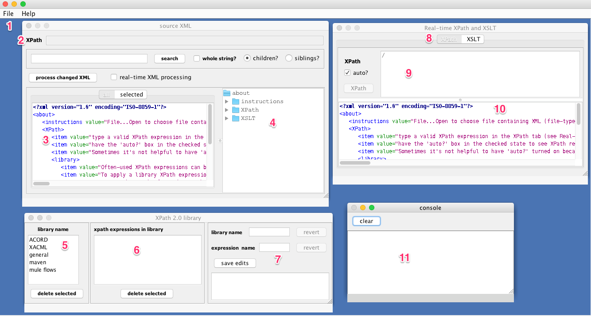
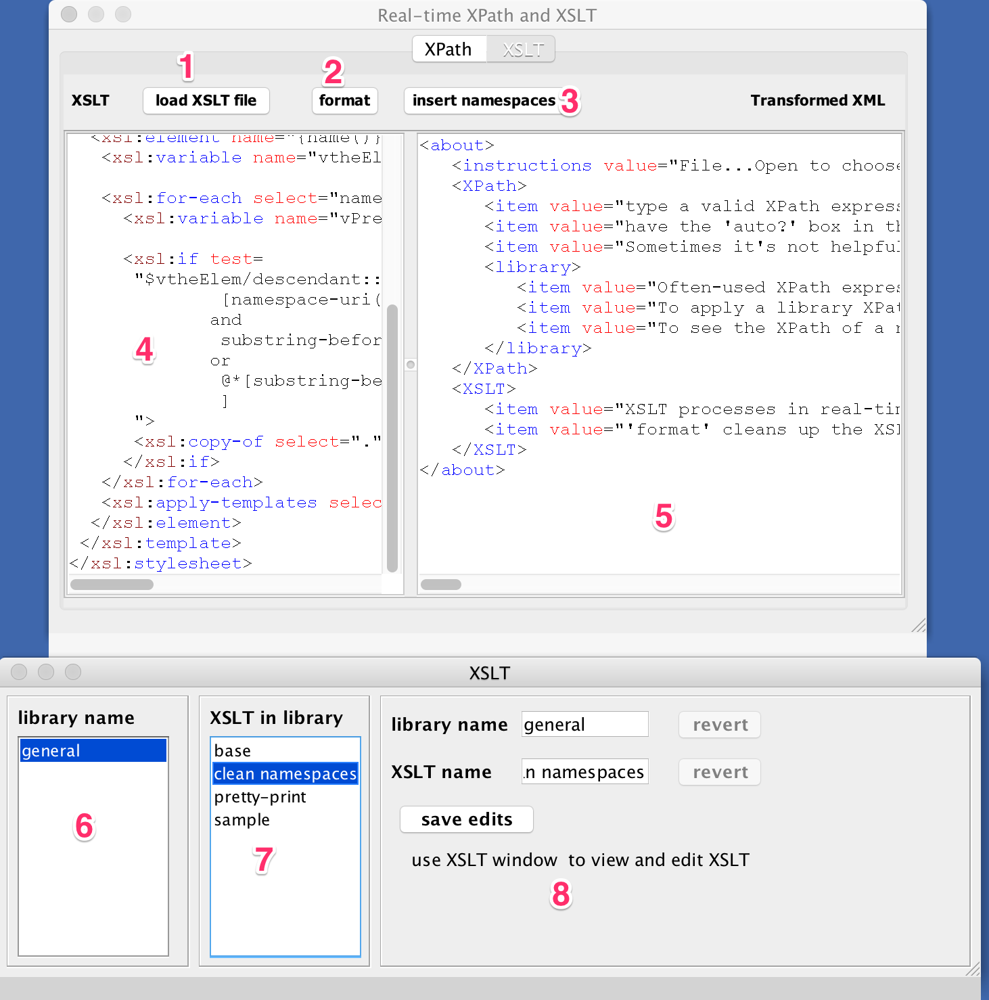

= Better-XML

XML, XPath2 and XSLT2 tools for anyone who

* needs more than the carpal-tunnel trials that Eclipse and Netbeans offer
* doesn't want to pay for XMLSpy or Oxygen

===== Feature list
::

. open XML and/or XSL file. Could also paste content
. see XPath of a given node by clicking in the tree-view (4)
. color-coded XML, pretty-printed by clicking *"process changed XML"* button above
. tree-view of XML
. XPath library list (a library is a group of related XPath expressions. Easily created:
.. type the name of a new library in the "library name" text-entry. Click the button that's now modified to read "save new empty library ___"
.. add a library-item by a) giving the expression a name (see "expression name" text-entry)
.. type or paste XPath2 in the text-area underneath the "save ..." button
.. click the "save" button.
.. to evaluate any XPath expression, click on its name in list-box at #6 to see results in texxt-area 10
. the list of named XPath expressions in the currently selected library
. use these input-elements to create new libraries, edit existing ones etc.
. switch between XPath and XSLT mode
. type XPath expressions in here, or select from your library (see 5 & 6). The "auto" check-box allows keystroke-events to trigger XPath evaluation (see results in box 10)
. console shows all errors or warnings. Note that not all rendered XPath results are valid XML (eg. `xx/yy/@someAttribute` will render something that is seldom valid XML - expect to see warnings here )

===== XSLT mode

. load XSLT file, or paste/edit on in-place. XSLT evaluation is dynamic/automatic (result is rendered in 5)
. pretty-print the XSLT
. XSLT needs namespaces to be declared. Avoid laborious typing:
.. load XML data in XML-window (#3 in the first image)
.. click in the right place in the XSLT
.. click "insert namespaces" button - all detected namespaces will be added to the XSLT namespace
. edit XSLT and watch results on the right in real-time. Of course, while the XSLT is invalid some windows will show error messages and output may go blank.
. XSLT-transformation output will show here
. define libraries of XSLT - a library is just a grouping of related XSLT transformations
. each library can contain as many transformations as desired.
. use these input-elements to create and edit entries.

The XSLT content that is saved/edited/created is always what is in window #4.

= Quick-start

* create a directory called `/derbyDBs`
** Windows - put this in the root of your primary drive - eg. `c:\derbyDBs`)
* put xpath_library.zip inside /derbyDBs and extract it there
** you know it's right when the file `service.properties` sits here: `/derbyDBs/xpath_library/service.properties`)
* cd into the source-location (same directory as POM file. Type `mvn clean package`

*Running*  `java -jar target/xpath20Tool-1.0`

== XPath

* Auto namespace discovery/registration
* Apply XPath to XML test or a loaded file
* Dynamic (if you want it) XPath updates results as you type
* Color-coded XML (when XPath result *is* XML) - easier to read than monotone

== Customizable XPath library at your fingertips
* Organized in libraries of your own naming
* Click a library to list the contained XPaths
* Click an item to evaluate the XPath on the current XML - see results in the XPath tab (above diagram)
* Dynamically create new XPath entries, or edit the existing entries

== XML

* See XML tree of the current XML node (click a node in tree-view)
* Click on a node to get the full XPath of that node, and to view just that node if you want

== XSLT
* See transformation results in real-time as you edit XSLT
* Load XSLT file
* Insert namespace declarations into the XSLT with a button-click - position the cursor in the XSL file where you want the namespaces to go before clicking
